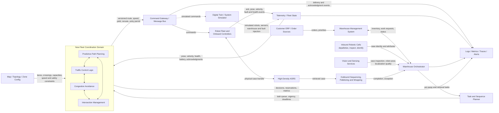

# System-Level QA Strategy for a Robot Fleet Coordination Release

**Candidate:** [Name] 
**Role:** Senior Software Quality Assurance Engineer 
**Document status:** Draft for submission 
**Testing window:** One week, simulation only

## 1. Executive Summary

This release changes a safety- and throughput-critical part of the warehouse: the software that coordinates robot movement. It adds predictive path planning, traffic control, congestion avoidance, and intersection management. A defect could cause collision risk, deadlock, starvation, stale commands, lost work, or a warehouse-wide throughput reduction.

My release decision would therefore be evidence-based and risk-driven. I would first prove the non-negotiable safety and liveness properties, then validate subsystem integration and failure handling, and finally measure performance under realistic and adversarial fleet loads. Most checks would be automated in a deterministic, time-accelerated simulator. Manual exploratory sessions would target emergent behavior that fixed scripts may miss.

The release is acceptable only if:

1. no collision or unsafe-separation event occurs in the agreed test suite;
2. no unrecovered deadlock, livelock, or indefinite robot starvation occurs;
3. command, map, task, and telemetry interfaces remain compatible;
4. recovery from delayed, duplicated, dropped, and out-of-order messages is bounded;
5. throughput and tail latency meet agreed targets and do not regress materially from the production baseline;
6. the simulation evidence is reproducible, traceable to a build and configuration, and has no unresolved release-blocking defects.

## 2. Context, Sources, and Assumptions

Public Symbotic material describes an end-to-end warehouse system in which inbound robotic cells depalletize and inspect cases, autonomous SymBots move goods within a high-density automated storage and retrieval system (ASRS), and outbound robotic cells build and wrap mixed-SKU pallets. AI-powered software coordinates inventory, sequencing, tasking, and routing and integrates with a customer's warehouse management system (WMS).

The detailed production architecture and protocols are not public. The component names and interfaces below are therefore a testable reference model, not a claim about Symbotic's proprietary implementation. Before execution, I would validate this model with system architects, controls engineers, operations, safety, and the simulation owner.

Key working assumptions:

- The coordination service receives robot pose, velocity, health, task, map, and reservation state.
- Robots or lower-level controllers enforce local emergency stopping independently of the central coordinator.
- Commands have robot ID, command ID, route/reservation version, issue time, expiry, and acknowledgment state.
- Time synchronization, map versions, and robot localization quality are observable.
- The simulator can run deterministically with a seed, accelerate virtual time, inject faults, and export synchronized event traces.
- Safety thresholds and performance targets shown as proposed values require product and safety-owner approval.

## 3. System Analysis

### 3.1 Reference Architecture and Data Flow

### 3.2 Component Roles

| Component | Role | Coordination-relevant inputs/outputs |
|---|---|---|
| Customer WMS / order source | Supplies orders and receives inventory and fulfillment status. | Order priority, cancellation, due time, inventory status. |
| Warehouse orchestrator | Converts business demand into coordinated inbound, storage, retrieval, and outbound workflows. | Work allocation, workflow state, exceptions. |
| Task and sequence planner | Creates robot work and sequences cases for storage or outbound pallet building. | Task queue, task dependencies, urgency, deadlines. |
| Inbound cells and vision | Depalletize, identify, inspect, orient, and admit cases. | Case identity, dimensions, damage status, induction availability. |
| ASRS and material-handling equipment | Physical storage topology, lifts, lanes, transfer points, and case locations. | Zone capacity, transfer readiness, blocked assets. |
| Robot fleet and onboard controllers | Execute movement and handling commands while reporting state; local controllers should preserve last-line safety. | Pose, velocity, localization quality, health, command acknowledgments. |
| Fleet telemetry/state service | Normalizes robot state into a current fleet view. | Timestamped state, freshness, confidence, missing-data indicators. |
| Predictive path planning | Forecasts trajectories from pose and task demand, then proposes conflict-aware routes. | Candidate paths, estimated arrival times, predicted conflicts. |
| Traffic control logic | Assigns movement priority and controls flow using density and urgency. | Priority updates, speed/yield decisions, traffic phase. |
| Congestion avoidance | Detects clusters or rising density and slows or reroutes robots before gridlock. | Density alerts, reroute requests, zone throttling. |
| Intersection management | Grants mutually safe, bounded-time crossing reservations. | Permit/grant/deny/revoke, occupancy and queue state. |
| Command gateway/message bus | Delivers versioned commands and acknowledgments between central and onboard software. | Delivery status, retry, ordering, expiration. |
| Observability platform | Correlates logs, metrics, traces, configuration, and events. | Alerts and evidence for diagnosis and release decisions. |
| Digital twin/system simulator | Models robots, sensors, topology, workloads, timing, and failures without physical equipment. | Reproducible scenarios and ground-truth safety/performance data. |

### 3.3 Critical Boundaries and Integration Risks

| Boundary | Main risk | Required control or test oracle |
|---|---|---|
| Telemetry → coordinator | Stale, noisy, impossible, or out-of-order pose data creates a false fleet state. | Freshness/quality flags; sequence checks; conservative fallback; ground-truth comparison. |
| Planner → coordinator | Task cancellation or reprioritization races with an active route. | Idempotent lifecycle; route/task versioning; atomic cancellation tests. |
| Four new subsystems | Conflicting decisions, such as one service granting entry while another reroutes the robot. | Explicit arbitration order, shared state/version, invariant monitor, decision trace. |
| Coordinator → command gateway → robot | Delayed, duplicated, reordered, expired, or unacknowledged commands. | Command IDs, expiry, acknowledgments, deduplication, fail-safe timeout. |
| Central control → local safety controller | Central optimization assumes stopping behavior that firmware cannot provide. | Firmware capability contract and independent local safety envelope. |
| Map/configuration → route logic | Mismatched topology, direction, speed limit, zone capacity, or coordinate frame. | Version handshake and rejection of incompatible configuration. |
| Time synchronization | Clock skew corrupts trajectory prediction, expiry, and event diagnosis. | Monotonic time where possible; skew alarms; skew-injection tests. |
| Mixed robot/firmware fleet | Different braking, acceleration, protocol, or feature support. | Capability negotiation and compatibility matrix coverage. |
| Zone-level congestion → global flow | Local improvement moves a queue downstream or produces oscillating reroutes. | End-to-end throughput, queue propagation, route-churn, and fairness metrics. |
| Coordinator availability | Restart, partition, or state loss leaves stale reservations or robots awaiting permits. | State recovery tests, lease expiry, safe degraded mode, bounded recovery objective. |
| Simulation → production | An inaccurate model can produce false confidence. | Model validation against approved physical-system traces and conservative uncertainty. |

## 4. Test Strategy

### 4.1 Quality Risks and Priorities

| Priority | Risk | Potential impact | Primary evidence |
|---|---|---|---|
| P0 | Collision or unsafe separation | Injury/equipment/product damage | Runtime safety monitor over all scenarios; adversarial conflict tests |
| P0 | Deadlock or fleet-wide loss of liveness | Operations stop; cascading delay | Wait-for graph, bounded-progress oracle, dense-load soak |
| P0 | Unsafe behavior after stale telemetry or lost commands | Collision or uncontrolled motion | Network fault injection and fail-safe tests |
| P1 | Starvation/unfair priority | Orders or robots wait indefinitely | Per-robot/task max wait, fairness distribution |
| P1 | Throughput or tail-latency regression | SLA and capacity loss | Baseline A/B performance runs with confidence intervals |
| P1 | Mixed-version incompatibility | Partial fleet outage | Robot/firmware/config compatibility matrix |
| P1 | Incorrect restart/recovery | Stale permits, duplicated work | Coordinator and broker restart scenarios |
| P2 | Excessive reroute or speed oscillation | Wear, energy use, unstable flow | Reroutes/km, command churn, acceleration profile |
| P2 | Poor diagnostics | Longer incident recovery | Log schema, correlation, alert and replay checks |

### 4.2 Coverage Model

Coverage is measured across behavior and operational dimensions, not only source-code lines.

- **Topology:** straight lanes, merges, four-way intersections, narrow shared zones, loading areas, lifts/transfer points, alternate-route and no-alternate-route zones.
- **Fleet state:** 1 robot, nominal load, peak load, overload; uniform and clustered distributions.
- **Demand:** balanced flow, crossing flow, burst arrivals, urgent task, cancellation, changing destination, inbound/outbound imbalance.
- **Robot diversity:** supported robot type, firmware, braking profile, payload, battery and health state.
- **Failures:** delayed/dropped/duplicated/reordered messages, stale/noisy location, clock skew, robot stop, blocked lane, service restart, broker interruption, map mismatch.
- **Algorithm thresholds:** just below, exactly at, and just above density, timeout, urgency, and reservation limits.
- **Duration:** short deterministic checks, peak-load runs, and time-accelerated multi-hour/multi-day soak.

Pairwise/combinatorial generation would cover broad combinations, while targeted P0 scenarios would use full combinations around critical boundaries. Every requirement and hazard maps to at least one test, one observable oracle, and one stored result. Code coverage is useful for unit/component suites but is not a substitute for scenario, state-transition, and invariant coverage.

### 4.3 Test Levels and Types

1. **Static analysis and design review**
   - Review state machines, locking/reservation rules, timeout semantics, arbitration, and degraded modes.
   - Run linters, type checks, security/dependency scans, and interface/schema compatibility checks.

2. **Unit and property-based testing**
   - Validate trajectory conflict detection, priority calculation, density thresholds, reservation expiry, deduplication, and map constraints.
   - Generate paths and schedules; assert no mutually exclusive reservations overlap and all grants respect topology constraints.

3. **Component/service testing**
   - Exercise each new subsystem through its public API with fake time and deterministic inputs.
   - Verify boundary values, state transitions, persistence, restart, idempotency, and invalid input handling.

4. **Contract and compatibility testing**
   - Validate telemetry, command, task, map, and observability schemas.
   - Run consumer-driven contracts and a supported firmware/robot/configuration matrix.

5. **Integration testing**
   - Join the four coordination subsystems, command gateway, telemetry, task planner, and observability.
   - Focus on concurrency, stale state, conflicting decisions, and asynchronous delivery semantics.

6. **System simulation**
   - Run realistic warehouse workflows in the digital twin.
   - Continuously evaluate safety, liveness, correctness, and performance against simulator ground truth.

7. **Regression testing**
   - Preserve fixed seeds for every escaped defect and critical scenario.
   - Compare the release candidate with the current production algorithm under identical seeds and workloads.

8. **Performance, scale, stress, and soak**
   - Measure throughput, task cycle time, intersection wait, queue depth, CPU/memory, decision latency, command latency, and recovery time.
   - Increase fleet and demand beyond expected peak to identify the knee point and failure mode.

9. **Resilience and fault-injection testing**
   - Inject network and service faults, bad telemetry, blocked paths, robot failures, and version mismatch.
   - Confirm bounded safe degradation and recovery without operator-dependent hidden steps.

10. **Manual exploratory testing**
    - Use live visualization and telemetry to explore emergent congestion, oscillation, unusual queue shapes, and operator-facing diagnostics.
    - Apply tours such as “follow the urgent robot,” “follow a stale command,” and “follow congestion as it moves between zones.”

### 4.4 Core Oracles and Metrics

The simulator must produce ground truth independent from the algorithm under test.

**Safety**

- collisions = 0;
- protected-zone and intersection occupancy never violates capacity;
- minimum separation and stopping-envelope constraints are never breached;
- every command is valid for the recipient, map version, route version, and time window.

**Liveness and fairness**

- every healthy robot with executable work makes progress within the approved bound;
- all reservation leases either complete, are revoked, or expire;
- no cycle persists in the robot/resource wait-for graph beyond the deadlock-detection bound;
- maximum and p99 wait time remain bounded, including low-priority traffic;
- repeated rerouting does not create livelock.

**Correctness**

- case and task state transitions occur once and in order;
- no robot simultaneously owns conflicting route segments;
- cancellation, retry, and restart do not duplicate or lose tasks;
- observed robot action corresponds to the latest valid acknowledged command.

**Performance**

- cases/orders completed per hour;
- robot task cycle time (p50/p95/p99/max);
- intersection wait and queue depth;
- coordinator decision latency and end-to-end command latency;
- stop time, idle time, distance, reroutes per distance, and energy proxy;
- CPU, memory, queue lag, dropped events, and backpressure.

Proposed release targets, subject to stakeholder approval:

- zero safety-invariant violations in all blocking tests;
- zero unrecovered deadlocks and zero lost/duplicated tasks;
- p99 intersection wait within the operational SLA and no robot waiting indefinitely;
- throughput no worse than the current algorithm by more than 2% at nominal load, and a statistically supported improvement in the congestion scenarios targeted by the release;
- p99 coordination decision latency below the control-loop budget;
- recovery from a single service restart within the agreed recovery objective, with robots entering a safe bounded state during recovery.

### 4.5 Simulation Approach

The simulator is both a test environment and an experimental instrument.

1. **Fidelity:** model topology, kinematics, acceleration/braking, payload effects, sensor uncertainty, controller delay, command delivery, transfer resources, and realistic task arrival patterns.
2. **Determinism:** store software build, simulator build, map/config version, workload, fault schedule, random seed, and virtual clock settings for every run.
3. **Time acceleration:** run many virtual hours for intermittent defects and rare scheduling interleavings.
4. **Fault injection:** inject faults at exact virtual times and at state-based triggers, such as when three robots approach a crossing.
5. **Runtime verification:** evaluate safety and liveness invariants continuously rather than relying only on final output.
6. **Differential testing:** replay identical scenarios against the production and candidate algorithms; report effect size and variance across multiple seeds.
7. **Replay and minimization:** record event traces, then reduce failing scenarios to the smallest fleet, topology, and event sequence that reproduces the issue.
8. **Model validation:** compare simulated acceleration, braking, localization error, message latency, and throughput distributions with approved real-system traces. Treat unvalidated regions as residual risk.

## 5. High-Level Test Plan

### 5.1 Objectives

- Verify safe, correct, live, and fair fleet behavior.
- Validate integration of all four coordination subsystems with the wider warehouse workflow.
- Demonstrate performance and congestion outcomes relative to the production baseline.
- Validate resilience, recovery, compatibility, and diagnosability.
- Produce auditable evidence for a go/no-go decision after one week.

### 5.2 Scope

**In scope**

- coordination services and their interfaces;
- task, telemetry, map/configuration, command, robot-controller, and observability integration;
- end-to-end inbound-to-storage and storage-to-outbound simulated workflows;
- supported robot/firmware profiles;
- functional, regression, performance, scale, soak, resilience, and recovery testing;
- operator-visible alerts and diagnostic data.

**Out of scope for this one-week simulation phase**

- physical robot hardware qualification;
- physical guarding and emergency-stop certification;
- camera calibration and mechanical durability;
- production deployment and live-site acceptance;
- WMS functionality unrelated to coordination.

These exclusions are residual release risks. A simulation pass does not replace hardware-in-the-loop, controlled physical-cell, safety-validation, or staged-deployment evidence.

### 5.3 Entry Criteria

- Release candidate is versioned, deployable, and code-frozen except for approved fixes.
- Requirements, hazards, supported versions, map, and proposed acceptance thresholds are reviewed.
- Simulator and baseline are qualified; invariant monitors pass known positive and negative controls.
- Test data, scenario catalog, dashboards, centralized logs, traces, and artifact storage are available.
- No unresolved blocker exists in the environment or test harness.

### 5.4 Exit Criteria

- All P0/P1 planned tests executed; all safety and liveness tests pass.
- No open Severity 1 or Severity 2 defect; any lower-severity waiver has owner, rationale, and mitigation.
- Regression suite passes, and candidate-vs-baseline performance meets approved thresholds.
- Soak reaches its target virtual duration across the required seeds without leak, drift, deadlock, or unbounded queue growth.
- Failed tests are understood and classified as product, environment, data, or test defects.
- Test report includes coverage, results, defects, residual risks, configurations, and artifact links.

### 5.5 People and Resources

| Resource | Responsibility |
|---|---|
| Senior SQA lead | Own plan, triage, risk assessment, exploratory testing, and release recommendation. |
| SQA automation engineer | Scenario automation, invariant monitors, result analysis, CI execution. |
| Fleet coordination engineer | Clarify algorithms and diagnose candidate defects. |
| Simulation/model owner | Validate fidelity, fault injection, replay, and simulator defects. |
| Robotics/controls and safety engineer | Review braking, safety envelopes, degraded modes, and hazards. |
| Operations/product representative | Confirm workflows, workload distributions, urgency rules, and SLAs. |
| Platform/SRE engineer | Validate deployment, messaging, observability, load, restart, and resource behavior. |
| Infrastructure | Parallel simulator workers, artifact store, metrics/log/trace backend, analysis notebooks/dashboards. |

### 5.6 One-Week Schedule

| Day | Activities | Deliverables / decision |
|---|---|---|
| Day 1 | Confirm requirements, hazards, architecture, assumptions, thresholds, and interface versions. Smoke-test environment and monitors. Run production baseline on representative seeds. | Approved scope and traceability matrix; qualified environment; baseline report. |
| Day 2 | Run unit/component/contract and subsystem integration suites. Test boundaries and mixed-version matrix. Start automated regression. | Early defect list; interface and subsystem results. |
| Day 3 | Run end-to-end nominal, dense traffic, intersections, urgent tasks, cancellation, and threshold tests. Conduct manual exploratory session. | Functional/system results; reproducible defect traces. |
| Day 4 | Run network/service/robot fault injection, restart/recovery, stress and performance A/B tests. Start accelerated soak on multiple seeds. | Resilience and performance comparison; updated risk assessment. |
| Day 5 | Analyze soak, rerun fixed defects and critical suite, close coverage gaps, conduct final triage, and prepare report. | Go/no-go recommendation, signed evidence package, residual-risk list. |

Execution is parallel where infrastructure allows. A P0 safety violation pauses promotion of that build, but independent diagnosis and unaffected tests may continue on controlled workers.

## 6. Example Test Cases

### TC-01 — Automated: Mutually Safe Intersection Reservations

**Objective:** Verify that intersection management never grants conflicting occupancy and that all healthy robots eventually cross under heavy contention.

**Type:** Automated integration test in deterministic simulation; P0.

**Preconditions**

- Candidate build and approved map/configuration are deployed.
- A four-way single-occupancy intersection is configured.
- Twelve healthy robots are staged equally across four approaches with continuous tasks.
- Ground-truth occupancy, reservation events, commands, and acknowledgments are captured.
- Safety and wait-for-graph monitors are active.

**Steps**

1. Start the run with fixed seed `INT-4WAY-001`.
2. Release all robots so their predicted arrival windows overlap.
3. Continue for 10,000 crossing attempts.
4. Repeat with each approach assigned urgent tasks in turn.
5. Repeat while injecting bounded command latency and telemetry jitter at the approved operating limit.
6. Query all grants, entry/exit times, queue waits, expiries, revocations, and minimum separations.

**Expected results**

- No overlapping incompatible grant or physical occupancy occurs.
- A robot enters only with a valid permit matching robot, intersection, route version, and time window.
- Expired/revoked permits cannot be used.
- No collision or stopping-envelope violation occurs.
- Every healthy robot crosses within the approved maximum wait; low-priority approaches do not starve.
- Duplicate or delayed events do not create duplicate ownership.
- p95/p99 wait and decision latency meet the agreed target.
- Replaying the same build/configuration/seed produces the same decision trace.

### TC-02 — Automated: Predictive Rerouting Under a Developing Hotspot

**Objective:** Verify that prediction and congestion avoidance reduce a developing queue without moving the bottleneck downstream or causing route oscillation.

**Type:** Automated end-to-end simulation and differential performance test; P1.

**Preconditions**

- Topology has a short primary path, an alternate path, two downstream merges, and realistic capacities.
- Nominal background traffic is active.
- Candidate and production-baseline algorithms can run against identical workload seeds.
- Congestion threshold is `D`; exact configured value is recorded.

**Steps**

1. Run baseline and candidate with density at `D-1`; record route decisions and metrics.
2. Repeat at `D` and `D+1`.
3. At virtual minute 10, introduce a burst of tasks whose shortest routes share the primary path.
4. At virtual minute 12, reduce downstream merge capacity for five minutes.
5. Restore capacity and run until all work completes.
6. Repeat across at least 30 fixed seeds and compare throughput and tail latency.

**Expected results**

- Behavior changes only according to documented threshold semantics; no off-by-one instability occurs.
- Candidate detects the rising hotspot early enough to keep queue length bounded.
- Slowdown/reroute commands are valid, acknowledged, and consistent with traffic/intersection grants.
- No collision, deadlock, starvation, or task loss occurs.
- Route changes do not oscillate; reroutes per robot remain within the approved bound.
- The alternate route and downstream merges remain within capacity.
- Candidate meets the approved throughput and p99 cycle-time criteria versus baseline with reported variance/confidence.
- After capacity restoration, queues drain and routing returns to nominal without manual intervention.

### TC-03 — Automated Fault Injection: Stale and Out-of-Order State

**Objective:** Verify safe degradation and recovery when coordinator input and robot commands are delayed, dropped, duplicated, or reordered.

**Type:** Automated resilience simulation; P0.

**Preconditions**

- Six robots approach two connected intersections.
- A programmable network proxy exists on telemetry and command channels.
- Message IDs, sequence numbers, source timestamps, expiry times, and acknowledgments are observable.
- Robot safe-state behavior is configured and approved.

**Steps**

1. Start nominal traffic and verify stable movement.
2. Delay one robot's pose updates beyond the freshness limit while continuing to deliver older samples.
3. Duplicate its last route command and deliver a newer slowdown command before an older speed-up command.
4. Drop the next intersection permit acknowledgment.
5. Partition the robot for the configured timeout, then restore communication.
6. Repeat for latency values just below, at, and above each timeout.
7. Verify post-recovery task and reservation state.

**Expected results**

- Stale/out-of-order telemetry is identified and never treated as current.
- The affected robot and nearby traffic enter the approved conservative state before safety margin is exhausted.
- Older, duplicate, expired, or wrong-version commands cannot override the latest valid state.
- A missing acknowledgment cannot create a second owner or an indefinite reservation.
- Other robots remain safe and make bounded progress where the topology permits.
- On reconnection, state is reconciled once; there is no duplicate task, phantom reservation, or sudden unsafe acceleration.
- Alerts identify robot, channel, last good sequence/time, affected reservation, and recovery.

### TC-04 — Simulation Soak: Intermittent Cluster Unresponsiveness

**Objective:** Detect rare fleet-state, resource, messaging, or coordination failures that emerge after hours and validate long-duration stability.

**Type:** Automated time-accelerated full-system simulation; P0/P1.

**Preconditions**

- Production-representative topology, fleet-size distribution, robot/firmware profiles, and task arrivals are loaded.
- Logs, metrics, distributed traces, scheduler events, thread dumps, queue state, wait-for graph, and simulator ground truth are synchronized.
- A snapshot/replay mechanism is enabled.
- Alerting detects missed heartbeat, stale command acknowledgment, no progress, queue growth, and resource exhaustion.

**Steps**

1. Run a 24-hour virtual warm-up at nominal load.
2. Run at least seven virtual days, including scheduled peak bursts and changing zone demand.
3. Inject seeded robot stops, short network impairment, service restarts, and blocked lanes at sparse intervals.
4. When any robot has no progress for the threshold, automatically capture a pre/post-event snapshot and continue if safe.
5. Repeat on multiple workers/seeds and replay any failure from the last good snapshot.
6. Compare candidate resource use, queue lag, progress, and completion metrics over time with baseline.

**Expected results**

- No collision, unrecovered deadlock/livelock, indefinite starvation, task loss, or duplicated work occurs.
- All injected faults invoke the expected safe behavior and recover within the approved objective.
- CPU, memory, handles, thread count, queue lag, reservation count, and state-store size reach a steady range rather than trend upward.
- Throughput and tail latency remain stable after warm-up.
- Any alert contains enough correlation data to replay the scenario.
- A replay with the same build/configuration/seed/fault schedule reproduces the same event sequence.

### TC-05 — Manual Exploratory: Priority, Fairness, and Operator Diagnostics

**Objective:** Explore emergent behavior when urgent and normal work compete in a congested loading area, and assess whether an operator can understand the system's decisions.

**Type:** Manual exploratory test using the simulation UI; P1.

**Preconditions**

- Candidate is running with visualization, dashboards, logs, and a supported operator interface.
- Two normal traffic streams and one low-volume approach share a loading-area intersection.
- Tester can create, reprioritize, and cancel tasks and can block/unblock a lane.
- A 60-minute charter and note template are prepared.

**Steps**

1. Observe ten minutes of balanced traffic and record normal queue behavior.
2. Create an urgent retrieval behind several normal tasks.
3. Block its preferred lane after planning but before arrival.
4. While the reroute is active, add a second urgent task from the opposite approach.
5. Repeatedly vary task priority near the density threshold, then cancel one task.
6. Follow the least-favored normal robot and check whether it eventually progresses.
7. Inspect operator messages, decision explanations, map state, correlation IDs, and recovery guidance.
8. Unblock the lane and observe stabilization.

**Expected results**

- Urgency changes priority within defined policy but never bypass safety.
- Normal work, especially the least-favored approach, is not indefinitely starved.
- Cancellation removes obsolete intent and reservations without abrupt unsafe motion.
- The system does not flap between routes or priorities.
- After unblocking, queues drain and stable behavior returns.
- UI, metrics, and logs agree on robot/task/zone state and provide actionable explanations.
- Any anomaly is captured with timestamp, build, map/config, seed, robot/task IDs, screenshot, and correlation ID.

## 7. Debugging the Intermittent Robot Cluster Freeze

### 7.1 Immediate Response

1. **Protect evidence and safety.** Pause or snapshot the failing simulation before resetting components. If the simulation's safety monitor predicts a violation, command the affected zone into its approved safe state and prevent new robot admission.
2. **Record identity.** Capture release and simulator builds, deployment manifest, feature flags, map/config versions, seed, virtual/host time, workload, fault schedule, affected zone, and first-observed time.
3. **Define “unresponsive.”** Determine whether robots stopped moving, stopped acknowledging, stopped sending telemetry, rejected commands, or were healthy but waiting for a resource. These are different failure classes.
4. **Measure blast radius.** List affected and neighboring robots, tasks, firmware, host/process/broker partitions, network path, shared map segments, intersections, chargers, lifts, and services.

### 7.2 Build a Synchronized Timeline

Use correlation fields—robot ID, task ID, command ID, route/reservation version, zone, service instance, trace ID, event sequence, source timestamp, receive timestamp—to reconstruct:

- last known-good pose and heartbeat;
- last task/state transition;
- last route, permit, and speed command;
- send, receive, acknowledgment, retry, expiry, and rejection events;
- first missed progress/heartbeat/acknowledgment;
- reservation ownership and wait-for dependencies;
- coordinator decision and leader/state-store events;
- queue lag, resource saturation, garbage collection, thread-pool, and network changes;
- downstream workflow effects.

All clocks are normalized to simulation monotonic time. Source/receive differences are retained to expose skew or transport delay.

### 7.3 Test Competing Hypotheses

I would avoid assuming firmware is the cause merely because robots appear frozen. Different batches and firmware versions reduce the probability of one firmware-specific defect, while a shared zone points first toward common dependencies.

| Hypothesis | Evidence to inspect | Discriminating experiment |
|---|---|---|
| Deadlock in reservations/intersections | Cyclic wait-for graph, non-expiring leases, robots waiting on one another | Replay; shorten lease or remove one resource/robot and see whether the cycle breaks |
| Livelock/reroute oscillation | Repeated route versions with no physical progress; high command churn | Freeze density input or disable one coordination feature in an isolated replay |
| Stale/partitioned telemetry | Increasing telemetry age, sequence gaps, broker lag, zone gateway errors | Inject equivalent delay/partition and compare signature |
| Command path failure | Commands created but not delivered/acked; retry buildup | Bypass or restart simulated gateway in replay; inspect partition ownership |
| Shared service/resource exhaustion | CPU/memory/threads/handles/state-store latency rise before event | Run accelerated soak with profiling and tighter leak alarms |
| Leader/state inconsistency | Election, split-brain, stale cache, or state-store errors near event | Trigger controlled failover under the same load |
| Map/configuration defect | Failure begins at same segment; incompatible zone/map version | Move workload to equivalent topology or correct version mismatch |
| Simulator defect | Ground truth/robot model stops while coordinator remains healthy | Run reduced model or independent simulator build; inspect simulation event loop |
| Clock skew/timeout defect | Expiry/lease decisions disagree across services | Inject known skew and compare event ordering |
| Workload-specific overload | Queue depth and latency cross a repeatable knee before freeze | Sweep load around the observed threshold |

### 7.4 Reproduce and Minimize

1. Replay from the nearest snapshot with the same seed and deterministic scheduler.
2. Confirm whether failure time and event sequence match.
3. Use binary search over the event trace to locate the earliest state divergence from a passing run.
4. Reduce robots, tasks, topology, and injected faults while preserving the failure.
5. Compare a passing baseline and failing candidate using the same minimized scenario.
6. Toggle one new subsystem at a time only in diagnostic builds; this isolates interaction but is not release evidence.
7. Add assertions at the earliest divergence, not only where robots finally stop.
8. Convert the minimized reproducer into a permanent automated regression.

### 7.5 Coordination and Asynchronous Handoff

I would open an incident/defect record and assign explicit workstreams:

- SQA incident lead: timeline, evidence integrity, reproducer, severity, and updates;
- fleet coordination owner: reservation, prediction, priority, and state-machine analysis;
- robotics/firmware owner: command handling, local safety state, and capability differences;
- simulation owner: model/event-loop validity, seed, snapshot, and replay;
- platform/SRE owner: broker, service, network, state store, resource and deployment evidence;
- operations/product owner: business impact, representative workload, and mitigation acceptability;
- safety owner: safe-state behavior and any hazard implications.

The asynchronous package contains:

- one-sentence symptom and operational impact;
- severity/priority and current safety status;
- exact build/configuration/map/seed and environment;
- affected robot/task/zone and correlation identifiers;
- normalized timeline with first divergence;
- expected versus actual behavior;
- frequency and shortest reproduction;
- logs, metrics, traces, snapshots, thread/profile dumps, and dashboard links;
- tested hypotheses and evidence for/against each;
- current owner per workstream, mitigation, residual risk, and next decision needed.

### 7.6 Immediate Mitigations

Mitigation must preserve safety before throughput:

1. stop admitting new robots/tasks to the affected zone;
2. let healthy robots leave under valid permits, or command a controlled stop if state confidence is insufficient;
3. expire/reconcile stale reservations only through an approved recovery procedure;
4. reroute work around the zone and rate-limit upstream task release;
5. restart the smallest failed service/component only after evidence capture and only if safe-state and state-reconciliation behavior are validated;
6. if the defect is candidate-specific, disable the implicated feature behind a validated flag or roll back to the known-good algorithm;
7. increase alerting for progress age, reservation age, command age, queue lag, and route churn.

A blind robot or service restart is not the first action: it may destroy evidence, release physical resources incorrectly, or cause stale commands to execute.

## 8. Defect Report

**Title:** `[S1] Cluster of robots becomes non-responsive in one storage zone during long-running full-system simulation`

**Severity / Priority:** Severity 1 / P0 pending safety review 
**Status:** New — investigation in progress 
**Detected in:** Fleet Coordination RC `[build]`; simulator `[build]` 
**Environment:** Full-system digital twin; map `[version]`; config `[version]`; seed `[seed]` 
**Regression:** Unknown until replay against the production baseline completes 
**Frequency:** Intermittent; observed approximately every few simulated hours (`[N]/[total runs]`) 
**Components:** Fleet coordination, telemetry/command transport, intersection/reservation state; simulator remains a possible contributor

### Summary

During a long-running full-system simulation, multiple robots in storage zone `[zone]` stop making progress. The cluster includes different robot batches and firmware versions. Their blocked work causes queue growth and delays in downstream workflows. Initial evidence suggests a shared zone-level coordination or infrastructure dependency rather than a single firmware version, but root cause is not yet established.

### Preconditions

- Candidate build `[build]` deployed with `[feature flags]`.
- Production-representative fleet and workload active.
- Simulation run `[run ID]`, seed `[seed]`, started `[timestamp]`.
- All robots healthy before the event; no known planned stop in the affected zone.

### Steps to Reproduce

1. Load map/configuration `[versions]` and workload `[artifact]`.
2. Deploy candidate `[build]` with manifest `[artifact]`.
3. Start simulation using seed `[seed]` and fault schedule `[artifact/none]`.
4. Run at `[load profile]` for approximately `[virtual duration]`.
5. Observe robot progress and zone queue dashboards.

Intermittent: deterministic replay and scenario minimization are in progress.

### Actual Result

- At `[T0]`, robot `[first robot ID]` stops making progress in `[segment/intersection]`.
- By `[T0 + delta]`, `[count]` robots in zone `[zone]` are non-responsive or blocked.
- Last known-good events: `[command/ack/pose/reservation IDs]`.
- Queue depth increases from `[x]` to `[y]`; downstream throughput changes by `[value]`.
- Robot heartbeat/telemetry/acknowledgment status: `[observed state]`.
- Safety monitor status: `[no violation observed / violation details / unknown]`.
- Recovery requires `[observed action, if any]`.

### Expected Result

Robots should continue bounded progress. If state, communication, or a resource is unavailable, robots should transition safely, reservations should expire or reconcile, unaffected traffic should continue where possible, and the system should alert and recover within the approved objective without losing or duplicating work.

### Impact

- Storage-zone workflow is blocked and delays cascade downstream.
- Throughput and order-cycle-time objectives are missed.
- A persistent cluster may become a safety concern if occupancy/reservation state diverges, even if no collision has yet been observed.
- The candidate is not releasable until the safety/liveness state and root cause are understood.

### Evidence

- Synchronized event timeline: `[link]`
- Logs and distributed traces: `[link]`
- Metrics/dashboard export: `[link]`
- Simulator snapshot and replay command: `[link]`
- Wait-for graph and reservation dump: `[link]`
- Thread/heap/profile and broker/state-store data: `[link]`
- Deployment, map, config, workload, seed, and fault schedule: `[link]`

### Initial Analysis

- Cross-firmware occurrence makes a firmware-version-only defect less likely.
- Zone clustering suggests a shared reservation/intersection, map, gateway, service partition, or resource.
- Top hypotheses are reservation deadlock, stale telemetry/command path, route livelock, shared resource exhaustion, and simulator event-loop failure.
- No root cause is claimed until passing/failing traces diverge reproducibly.

### Workaround / Mitigation

Quarantine the affected zone, stop new admissions, reroute/rate-limit upstream work, preserve a controlled safe state, and capture evidence. Use only validated state-reconciliation/restart procedures. Roll back or disable the candidate feature if the failure is confirmed candidate-specific.

### Assignment and Handoff

- Incident/SQA lead: `[name]`
- Coordination owner: `[name/time zone]`
- Platform/SRE owner: `[name/time zone]`
- Simulation owner: `[name/time zone]`
- Firmware/controls owner: `[name/time zone]`
- Safety reviewer: `[name/time zone]`
- Next update / requested decision: `[UTC timestamp and question]`

## 9. Release Recommendation Format

At the end of the week, I would issue one of three recommendations:

- **Go:** all blocking criteria pass, performance is acceptable, and residual risks are explicitly accepted.
- **Conditional go:** only when remaining non-blocking risks have approved mitigations, monitoring, owner, and rollback criteria.
- **No-go:** any unresolved safety invariant, deadlock/livelock, task-integrity issue, unsupported compatibility case, unbounded recovery, or material performance regression remains.

The recommendation would include execution counts by priority, requirements/hazard coverage, candidate-versus-baseline performance, open defects, excluded tests, simulator-model limitations, and the follow-on evidence required from hardware-in-the-loop and controlled physical-system testing.

## References

1. Symbotic, “Symbotic System / Why Symbotic for Warehouse Automation,” https://www.symbotic.com/symbotic-system/
2. Symbotic, “Distribution Solution,” https://www.symbotic.com/solutions/distribution-solution/
3. Symbotic, “Warehouse Automation Solutions,” https://www.symbotic.com/solutions/
4. Symbotic, “Warehouse Robotics,” https://www.symbotic.com/solutions/robots/
5. Symbotic, “Advanced Robotic Vision and Sensing,” https://www.symbotic.com/blog/advanced-robotic-vision-and-sensing/

Public references were used only for the high-level warehouse flow. All proposed internal services, interfaces, test thresholds, and failure semantics are assumptions to be validated with the actual system owners.
